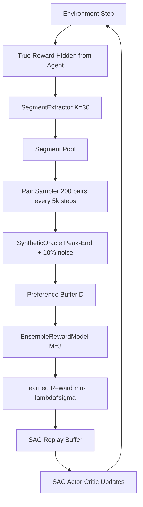
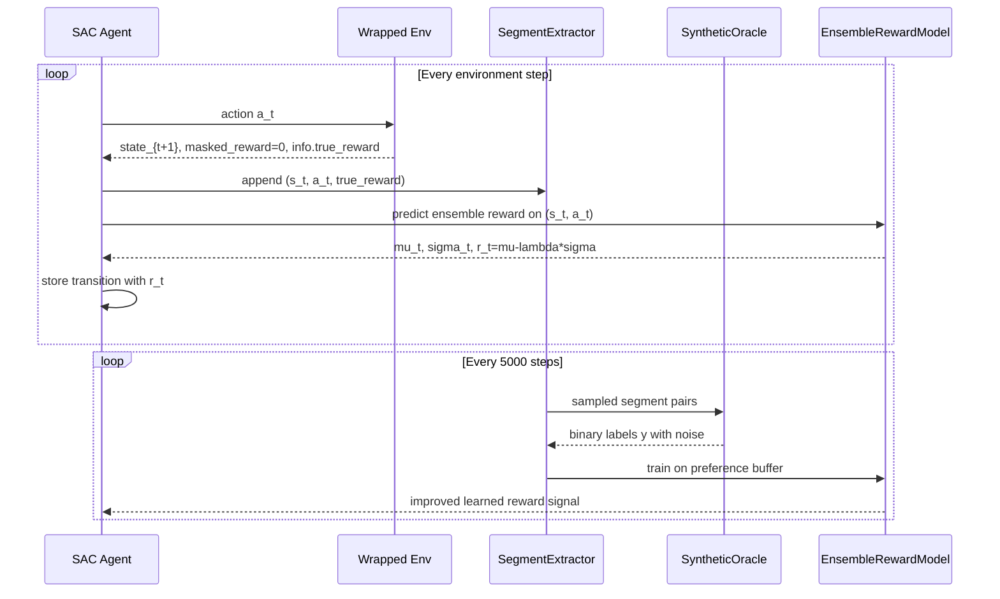
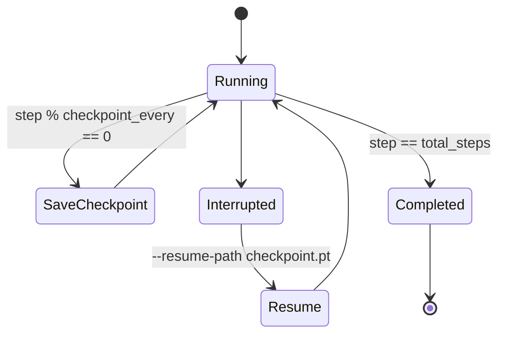

# Memory-Constrained Preference-Based Reinforcement Learning (PbRL)

A complete PyTorch implementation of Preference-Based Reinforcement Learning with Peak-End cognitive heuristics and uncertainty-aware SAC integration.

This project trains an agent using **learned rewards from pairwise preferences** rather than directly optimizing environment reward. It is designed to run under constrained hardware budgets, avoid pixel/CNN pipelines, and support long-running fault-tolerant training with checkpoint resume.

---

## 1. Project Summary

### Core idea
Instead of feeding true environment reward to SAC, we:
1. Collect trajectory segments of fixed length `K=30`.
2. Query a synthetic oracle for pairwise preferences based on Peak-End utility.
3. Train an ensemble reward model from preference labels.
4. Use uncertainty-penalized learned reward `r_t = mu_t - lambda * sigma_t` for SAC updates.

### Why this helps
- Solves delayed credit assignment without expensive attention models.
- Improves robustness via ensemble uncertainty penalty.
- Keeps memory/VRAM demands practical for consumer GPUs.

---

## 2. Mathematical Formulation

This project implements a **Peak-End Utility** model for Reinforcement Learning from Human Feedback (RLHF), where the agent's reward is biased toward the maximum and final experiences of a trajectory.

### Oracle Peak-End Utility
The "ground truth" utility for a segment $\tau = \{(s_t, a_t, R_{true, t})\}_{t=1..K}$ is defined by a weighted sum of the **Peak** reward and the **End** reward:

$$U_{true}(\tau) = 0.7 \cdot \max_{t \in [1, K]} R_{true}(s_t, a_t) + 0.3 \cdot R_{true}(s_K, a_K)$$

**Preference Labeling:**
For any pair of segments $(\tau_A, \tau_B)$, the preference label $y$ is generated as:
* $y = 1$ if $U_{true}(\tau_A) > U_{true}(\tau_B)$
* $y = 0$ otherwise
* *Note: A 10% label flip noise is applied to simulate human inconsistency.*

---

### Learned Utility (Ensemble)
For each reward predictor $\hat{R}_{\theta_i}$ in an ensemble, we learn a utility function $U_{\theta_i}(\tau)$. We treat the weights $\omega_1$ and $\omega_2$ as learnable parameters (initialized at $0.5$):

$$U_{\theta_i}(\tau) = \omega_1 \cdot \max_t \hat{R}_{\theta_i}(s_t, a_t) + \omega_2 \cdot \hat{R}_{\theta_i}(s_K, a_K)$$

---

### Preference Learning
We use the **Bradley-Terry Model** to estimate the probability that segment $A$ is preferred over segment $B$:

$$P_{\theta_i}(\tau_A \succ \tau_B) = \frac{\exp(U_{\theta_i}(\tau_A))}{\exp(U_{\theta_i}(\tau_A)) + \exp(U_{\theta_i}(\tau_B))}$$

The model is optimized using the **Cross-Entropy Loss**:

$$\mathcal{L}(\theta_i) = -\mathbb{E}_{(A, B, y)} \left[ y \log P_{\theta_i}(A \succ B) + (1-y) \log P_{\theta_i}(B \succ A) \right]$$

---

### SAC Reward & Uncertainty
To encourage risk-averse behavior or exploration, we derive the final reward for the Soft Actor-Critic (SAC) agent from the ensemble ($M=3$) statistics of $\hat{R}_{\theta_i}(s_t, a_t)$:

**Ensemble Statistics:**
$$\mu_t = \frac{1}{M} \sum_{i=1}^M \hat{R}_{\theta_i}(s_t, a_t) \quad , \quad \sigma_t = \text{Std}(\hat{R}_{\theta_1}, \dots, \hat{R}_{\theta_M})$$

**Final Reward Mapping:**
We apply an **Uncertainty Penalty** ($\lambda = 0.1$) to the mean reward:

$$r_t = \mu_t - \lambda \sigma_t$$
## 3. System Architecture



---

## 4. Active Preference Collection Cycle



---

## 5. Fault-Tolerant Checkpointing and Resume



Checkpoint payload includes:
- SAC model and optimizer states
- temperature parameter (`log_alpha`) and entropy target
- replay buffer contents
- reward model weights + optimizer state
- segment pool and preference buffer
- global step and episode index

---

## 6. Repository Structure

- `env_utils.py`
  - `MaskTrueRewardWrapper` hides true reward from SAC.
  - `SegmentExtractor` creates strict non-overlapping `K=30` segments.
  - `ContinuousGridworldEnv` provides low-dimensional fallback environment.
  - `make_env` supports `auto`, LunarLander, and gridworld modes.

- `oracle.py`
  - `SyntheticOracle` implements noisy Peak-End utility labeling.

- `reward_model.py`
  - `RewardMLP`: `Linear(64)->ReLU->Linear(64)->ReLU->Linear(1)`.
  - `RewardMember` has learnable `omega_1`, `omega_2`.
  - `PeakEndBCE` (Bradley-Terry via BCEWithLogits).
  - `EnsembleRewardModel` with uncertainty and preference training.

- `sac_agent.py`
  - Standard SAC for continuous action spaces.
  - Replay buffer and full checkpoint serialization/restore.

- `train.py`
  - End-to-end coordinator for data collection, oracle querying,
    reward model training, SAC updates, TensorBoard logging,
    and checkpoint save/resume.

---

## 7. Installation

## Option A: Existing Python environment

```bash
python -m pip install -r requirements.txt
```

## Option B: Recommended clean venv

```bash
python -m venv .venv
# Windows PowerShell:
.venv\Scripts\Activate.ps1
python -m pip install --upgrade pip
python -m pip install -r requirements.txt
```

---

## 8. Running Training

### CUDA run (auto environment selection)

```bash
python train.py --total-steps 10000 --device cuda --env-name auto
```

### Force LunarLanderContinuous-v2 (requires Box2D working)

```bash
python train.py --total-steps 300000 --device cuda --env-name lunar_lander_continuous
```

### Force fallback continuous gridworld

```bash
python train.py --total-steps 300000 --device cuda --env-name continuous_gridworld
```

### Resume from checkpoint

```bash
python train.py \
  --total-steps 300000 \
  --device cuda \
  --env-name auto \
  --resume-path checkpoints/pbrl_step_10000.pt
```

---

## 9. TensorBoard Monitoring

```bash
tensorboard --logdir runs
```

Key metrics:
- `env/true_return`
- `env/episode_length`
- `sac/critic_loss`, `sac/actor_loss`, `sac/alpha`
- `reward_model/preference_loss`
- `reward_model/preference_accuracy`
- `reward_model/step_mean_prediction`
- `reward_model/step_std_prediction`
- `reward_model/ensemble_variance_probe`

---

## 10. Configuration Defaults

Important defaults in `TrainConfig`:
- `segment_length = 30`
- `preference_pairs_per_update = 200`
- `preference_update_interval = 5000`
- `reward_batch_size = 64`
- `reward_epochs = 3`
- `ensemble_size = 3`
- `uncertainty_coef = 0.1`
- `checkpoint_every = 5000`

These settings are intentionally conservative for memory-constrained experiments.

---

## 11. Memory / VRAM Guidance (6GB Target)

Recommended practical settings for 6GB GPUs:
- Keep observation/action spaces low-dimensional (already satisfied).
- Keep reward-model preference batch size small (`64` or lower).
- Use modest SAC batch size if needed (reduce from `256` if OOM).
- Avoid rendering and pixel observation pipelines.
- Prefer checkpointing over large in-memory diagnostics.

If CUDA OOM occurs:
1. Lower `batch_size` (SAC).
2. Lower `reward_batch_size`.
3. Train with `--device cpu` as fallback.

---

## 12. Reproducibility Notes

- Global seeds are set for Python random, NumPy, and Torch.
- Ensemble members use different initialization seeds.
- Checkpointing allows deterministic continuation from saved state.

---

## 13. Troubleshooting

### Box2D install issues on very new Python versions
If LunarLander dependencies fail to build (common on bleeding-edge Python), run with:

```bash
python train.py --env-name continuous_gridworld --device cuda
```

or keep `--env-name auto` to try LunarLander first and fallback automatically.

### CUDA requested but unavailable
If no CUDA device is present or visible to PyTorch, switch to:

```bash
python train.py --device cpu
```

---

## 14. Validation Status in This Workspace

A short run has been executed successfully with:
- `--total-steps 10000`
- `--device cuda`
- `--env-name auto`

Observed behavior:
- Episodes completed normally.
- Preference training triggered at steps 5000 and 10000.
- Checkpoints written to `checkpoints/pbrl_step_5000.pt` and `checkpoints/pbrl_step_10000.pt`.

---

## 15. Citation-Friendly Method Summary

This implementation instantiates a memory-efficient PbRL framework where preferences are generated online via a noisy Peak-End oracle, reward is modeled by a 3-member MLP ensemble with learnable Peak-End aggregation, and policy optimization is performed with SAC using uncertainty-penalized predicted rewards. The design prioritizes stable training under constrained compute while preserving preference-learning realism via label noise and active pair collection.
